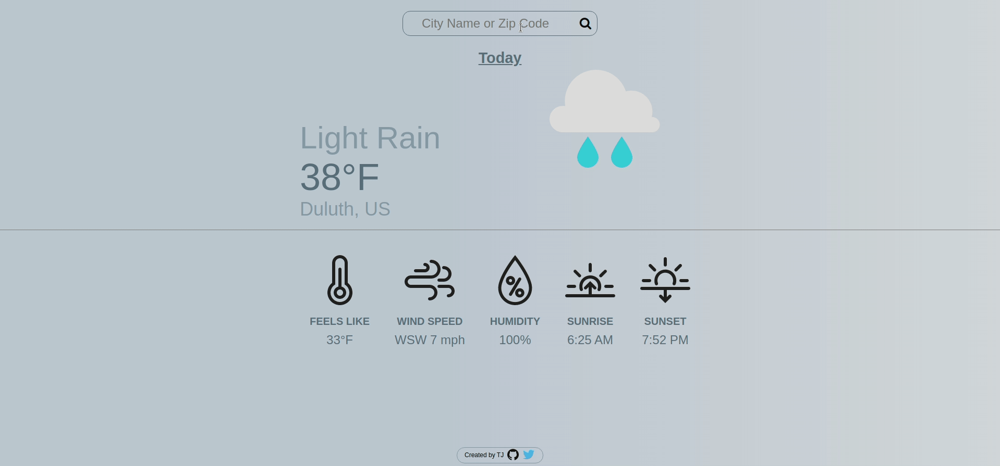

<h1 align="center">
   
  Weather App
   
  <image src="src/assets/thunderstorms.svg" width="30%"> 
</h1>

<h4 align="center">Check your local weather by city name or zip code. I used JavaScript, HTML, and SASS for this project.</h4>

  <a href="#screenshots">Screenshots</a> •
  <a href="#goals">Goals</a> •
  <a href="#summary">Summary</a> •
  <a href="#author">Author</a> •
    <a href="#credits">Credits</a> •
  <a href="#license">License</a>

### ✨ [Live Preview](https://timjacksonm.github.io/Weather-App/)
## Screenshots

  
Show Image

  

The below images showcase responsive web design across a couple different devices.

  <image src="src/assets/s5preview.png">
  <image src="src/assets/iphone8preview.png">
  <image src="src/assets/ipadpreview.png">

## Goals:
- [✔️] Write functions that use the API to fetch weather for an area.
- [✔️] Create the functions that will proccess the JSON data you're getting from the API and return an object with the data you require for you app. (temp, wind, description, extended forcast etc)
- [✔️] Set up a simple form that will let users input their location and fetch the weather info.
- [✔️] Display the info on your webpage!
- [✔️] Add any styling you like!

**Optional Extra Credit**
- [✔️] learn the difference between em & rem units and implement them into the project instead of usign px for everything.
- [✔️] learn the different positions you can apply to an element for example position: absolute  - position: relative. Use in project.
- [ ] Add a 'loading' component that displays from the time the form is submitted until the information comes back from the API.
- [ ] Review the different syntax used for SASS and implement SASS into the project instead of normal CSS.
- [ ] Add extended forcast.

**View Commits on project to see changes**

## Summary

I went for more of a simple style with multiple themes. I used async and await to help control the asynchronous data I was fetching from the api's server. Started to use SASS for the first time in a project. Nesting is huge to organizing my css code, made finding certain parts so much easier. Still a few extra credit goals I would like to come back and update when I have time. A few personal extra credit goals also 'extended forcast'. Looks great on mobile! Check out the screenshots to see all 4 themes!

## Author

👤 **Tim Jackson**

- Github: [@timjacksonm](https://github.com/timjacksonm)
- Twitter [@timjacksonm](https://twitter.com/timjacksonm)
- LinkedIn [@timjacksonm](https://linkedin.com/in/timjacksonm)

## Credits

This project idea was a part of my studies at The Odin Project's curriculum. You can see the lesson <a href="https://www.theodinproject.com/paths/full-stack-javascript/courses/javascript/lessons/weather-app" target="_blank">here</a>!

## License

  <a href="https://choosealicense.com/licenses/mit/">
    

